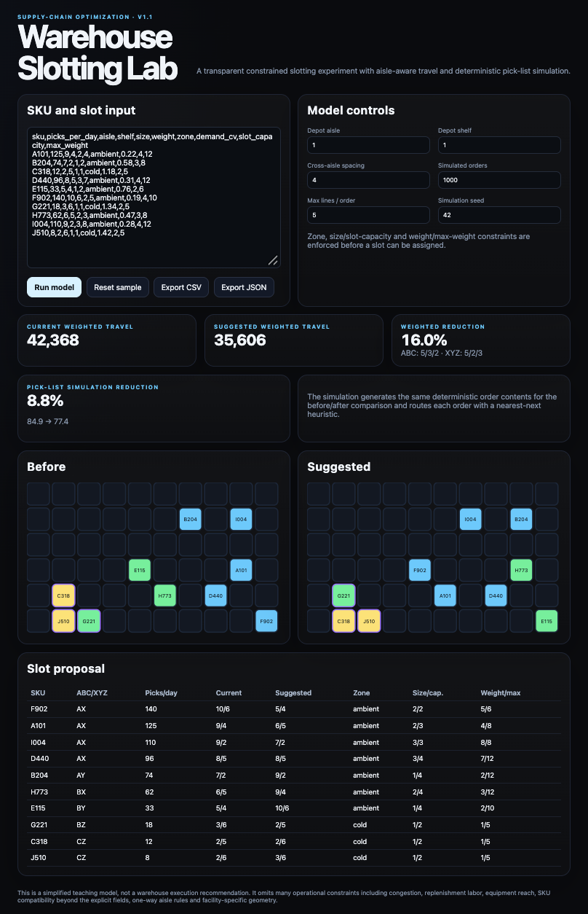

# Warehouse Slotting Lab

A transparent browser experiment connecting warehouse operations with small, inspectable optimization models.

**Live demo:** https://dexter02-crypt.github.io/warehouse-slotting-lab/

**Release:** [v1.1.0](https://github.com/dexter02-crypt/warehouse-slotting-lab/releases/tag/v1.1.0)



## v1.1 model

The model now includes:

- ABC classification from cumulative pick activity;
- XYZ variability classes from supplied demand coefficient of variation;
- aisle-aware travel through a front cross aisle;
- configurable depot and aisle spacing;
- SKU size and weight requirements;
- slot capacity and maximum-weight limits;
- simple zone restrictions;
- deterministic pick-list simulation using the same orders before and after slotting;
- before/after layout views;
- CSV and JSON exports.

The optimizer processes high-pick SKUs first and selects the nearest unused compatible slot. This is intentionally transparent rather than a claim of global mathematical optimality.

## Input

Extended input:

```csv
sku,picks_per_day,aisle,shelf,size,weight,zone,demand_cv,slot_capacity,max_weight
A101,125,9,4,2,4,ambient,0.22,4,12
```

The original four-column format is still accepted and receives neutral defaults.

## Run

```bash
python3 serve.py
```

## Test

```bash
npm test
```

## Scope

This remains a teaching model. It does not represent a warehouse management system, digital twin, engineered labor standard, or deployable slotting recommendation. Important omitted effects include replenishment workload, congestion, equipment reach, one-way aisle rules, handling compatibility beyond the explicit fields, batch/zone picking policies and actual facility geometry.

## License

MIT. Maintainer: Shikhar Singh.
